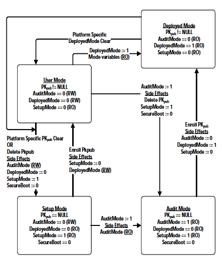

**UEFI SCT II Case Specification**

# 3 Boot Services Test
## 3.4 SecureBoot Boot Services Test

**Reference Document:**

_UEFI Specification_, SecureBoot Runtime Services Section.

**Secure Boot Boot Services Functions**
| **Name** | **Type** | **Description** |
| --- | --- | --- |
| ImageLoading | Runtime | Verifies Secure Boot Image Loading. |

The Secure Boot tests require a set of keys generated for PK, KEK, db, dbx.

### 4.5.3 ImageLoading()

The ImageLoading() test uses the following images:
- TestImage1: Image that is not signed
- TestImage2: Image that is signed with Image2Cert (cert not in db)
- TestImage3: Image that is signed with Image3Cert (cert in db)
- TestImage4: Image that is signed with Image4Cert (cert in db)
- TestImage5: Image that is not signed (hash in db)
- TestImage6: Image that is signed with Image6Cert (cert in db, revoked in dbx with SHA256 of cert)
- TestImage7: Image that is signed with Image7Cert (cert in db, revoked in dbx with SHA384 of cert)
- TestImage8: Image that is signed with Image8Cert (cert in db, revoked in dbx with SHA512 of cert)
- TestImage9: Image that is signed with Image9Cert (cert in db, revoked in dbx with cert)
- TestImage10: Image that is signed with Image10Cert (cert in db, revoked in dbx with hash of image)
- TestImage11: Image that is signed with Image11Cert (cert in db, but image has been tampered with)

The Image[n]Cert certificates used in this test are all created using: X.509, RSA2048, SHA256.

The variable db must be populated with a signature list that contains the following:
- ImageCert3
- ImageCert4
- ImageCert6
- ImageCert7
- ImageCert8
- ImageCert9
- ImageCert10
- ImageCert11
- EFI\_CERT\_SHA256\_GUID(TestImage5)

The variable dbx must be populated with a signature list that contains the following:
- EFI\_CERT\_X509\_SHA256\_GUID(ImageCert6)
- EFI\_CERT\_X509\_SHA384\_GUID(ImageCert7)
- EFI\_CERT\_X509\_SHA512\_GUID(ImageCert8)
- ImageCert9
- EFI\_CERT\_SHA256\_GUID(TestImage10)

The test infrastructure must transition the firmware to User Mode with SecureBoot=1 to run these test cases.

| **Number** | **GUID** | **Assertion** | **Test Description** |
| --- | --- | --- | --- |
| 4.5.3.1 | 0x6c605b08, 0x2ab7, 0x4681, 0x9f, 0x2f, 0x74, 0xd0, 0x8d, 0x96, 0x4e, 0x35 | **SecureBoot** - Verify load of unsigned image. | Invoke LoadImage on TestImage1 with no signature <ol type="a"><li>Verify LoadImage returns EFI\_SECURITY\_VIOLATION.</ol> |
| 4.5.3.2 | 0x34daa12d, 0x302b, 0x4afd, 0x9f, 0x1f, 0xcb, 0x55, 0x2e, 0x59, 0x48, 0xbe | **SecureBoot** - Verify load of signed image, but no cert in db. | Invoke LoadImage on TestImage2 with signature matching no certificate in db.<ol type="a"><li>Verify LoadImage returns EFI\_SECURITY\_VIOLATION.</ol> |
| 4.5.3.3 | 0x5e1c06cb, 0xf84a, 0x4b38, 0x80, 0x96, 0x2f, 0x7b, 0x95, 0x91, 0xbb, 0x3a | **SecureBoot** - Verify load of signed image, first certificate in db. | Invoke LoadImage on TestImage3 signed with first certificate in db.<ol type="a"><li>Verify LoadImage returns EFI\_SUCCESS</ol> |
| 4.5.3.4 | 0x85f7e35e, 0xe333, 0x4d44, 0x83, 0xf8, 0x03, 0x39, 0x41, 0x89, 0xf3, 0xb2 | **SecureBoot** - Verify load of signed image, second certificate in db. | Invoke LoadImage on TestImage4 signed with second certificate in db.  <ol type="a"><li>Verify LoadImage returns EFI\_SUCCESS |
| 4.5.3.5 | 0xaa8167ae, 0xf03a, 0x4074, 0xb2, 0x78, 0xd6, 0xf1, 0x29, 0x0a, 0x86, 0xa7 | **SecureBoot** - Verify load of unsigned image with hash in db. | Invoke LoadImage on TestImage5, which is unsigned with SHA256 hash of image in db.<ol type="a"><li>Verify LoadImage returns EFI\_SUCCESS</ol> |
| 4.5.3.6 | 0xb62a25f4, 0xc24e, 0x4853, 0x9a, 0xd1, 0x8b, 0x3f, 0xc5, 0x9b, 0x29, 0xd7 | **SecureBoot** - Verify load of signed image with certificate in db and revoked in dbx with SHA256 hash. | Invoke LoadImage on TestImage6 with signature in db but revoked in dbx with EFI\_CERT\_X509\_SHA256\_GUID.<ol type="a"><li>Verify LoadImage returns EFI\_SECURITY\_VIOLATION.</ol>  |
| 4.5.3.7 | 0xb62a25f4, 0xc24e, 0x4853, 0x9a, 0xd1, 0x8b, 0x3f, 0xc5, 0x9b, 0x29, 0xd7 | **SecureBoot** - Verify load of signed image with certificate in db and revoked in dbx with SHA384 hash. | Invoke LoadImage on TestImage7 with signature in db but revoked in dbx with EFI\_CERT\_X509\_SHA384\_GUID.<ol type="a"><li>Verify LoadImage returns EFI\_SECURITY\_VIOLATION.</ol>  |
| 4.5.3.8 | 0xb62a25f4, 0xc24e, 0x4853, 0x9a, 0xd1, 0x8b, 0x3f, 0xc5, 0x9b, 0x29, 0xd7 | **SecureBoot** - Verify load of signed image with certificate in db and revoked in dbx with SHA256 hash. | Invoke LoadImage on TestImage8 with signature in db but revoked in dbx with EFI\_CERT\_X509\_SHA512\_GUID.<ol type="a"><li>Verify LoadImage returns EFI\_SECURITY\_VIOLATION.</ol>  |
| 4.5.3.9 | 0x54e33072, 0x43d2, 0x4fbf, 0xb4, 0x4e, 0x1d, 0x1c, 0xe7, 0xf7, 0x1a, 0xd2 | **SecureBoot** - Verify load of signed image with certificate in db and revoked in dbx with certificate. | Invoke LoadImage on TestImage9 with signature in db, but also revoked in dbx with ImageCert9.<ol type="a"><li>Verify LoadImage returns EFI\_SECURITY\_VIOLATION.</ol>  |
| 4.5.3.10 | 0x20a23f21, 0x31f1, 0x4264, 0xa6, 0xcb, 0x7d, 0xc7, 0xe6, 0x96, 0x3c, 0x63 | **SecureBoot** - Verify load of signed image with certificate in db and revoked in dbx with hash of image. | Invoke LoadImage on TestImage10 with cert in db, but revoked with SHA256 hash of image in dbx. <ol type="a"><li>Verify LoadImage returns EFI\_SECURITY\_VIOLATION.</ol> |
| 4.5.3.11 | 0xa5851395, 0xdee0, 0x45e7, 0xa5, 0xd2, 0x8f, 0x73, 0x3e, 0x58, 0x2d, 0xc2 | **SecureBoot** - Verify load of signed image with signature that has been tampered with so signature check fails. | Invoke LoadImage on TestImage11 with certificate in db. (TestImage11 has been tampered with so signature check should fail.) <ol type="a"><li>Verify LoadImage returns EFI\_SECURITY\_VIOLATION.</ol> |

 
The following tests examine the Image Execution Info Table based on tests 4.5.3.1 - 4.5.3.8.

| **Number** | **GUID** | **Assertion** | **Test Description** |
| --- | --- | --- | --- |
| 4.5.3.12 | 0x4bb36713, 0xd8e2, 0x405b, 0x8b, 0xda, 0x86, 0x12, 0xc7, 0x92, 0x91, 0xa9 | **SecureBoot** - Verify Image Execution Info Table entry for TestImage1, image not signed. | Read the Image Execution Information Table (EFI\_IMAGE\_EXECUTION\_INFO\_TABLE).<ol type="a"><li>Verify image is TestImage1<li>Verify that action is UNTESTED.</ol> |
| 4.5.3.13 | 0x3b48371b, 0xc27e, 0x4c19, 0xb9, 0x99, 0x54, 0x53, 0x7e, 0xa4, 0xbf, 0xed | **SecureBoot** - Verify Image Execution Info Table entry for TestImage2, image signed but cert not in db. | Read the Image Execution Information Table (EFI\_IMAGE\_EXECUTION\_INFO\_TABLE).<ol type="a"><li>Verify image is TestImage2<li>Verify that action is SIG\_NOT\_FOUND.</ol>  |
| 4.5.3.14 | 0xb3a670aa, 0x0fba, 0x48ca, 0x9d, 0x01, 0x0e, 0xe9, 0x70, 0x09, 0x65, 0xa9 | **SecureBoot** - Verify Image Execution Info Table entry for TestImage6, revoked by hash of cert | Read the Image Execution Information Table (EFI\_IMAGE\_EXECUTION\_INFO\_TABLE).<ol type="a"><li>Verify image is TestImage6<li>Verify that action is SIG\_FAILED.</ol> |
| 4.5.3.15 | 0x00c3c2f2, 0x39d5, 0x4d35, 0xb7, 0xe7, 0x58, 0x7c, 0xa0, 0xf3, 0xcb, 0x75 | **SecureBoot** - Verify Image Execution Info Table entry for TestImage7, revoked by hash of cert. | Read the Image Execution Information Table (EFI\_IMAGE\_EXECUTION\_INFO\_TABLE).<ol type="a"><li>Verify that image is TestImage7<li>Verify that action is SIG\_FAILED.</ol> |
| 4.5.3.16 | 0x55211c3f, 0xc438, 0x485a, 0xb1, 0x75, 0xb1, 0xef, 0x5d, 0x31, 0x41, 0xc7 | **SecureBoot** - Verify Image Execution Info Table entry for TestImage8, revoked by hash of cert. | Read the Image Execution Information Table (EFI\_IMAGE\_EXECUTION\_INFO\_TABLE).<ol type="a"><li>Verify that image is TestImage8<li>Verify that action is SIG\_FAILED.</ol> |
| 4.5.3.17 | 0x32a28ae3, 0x9dcb, 0x4f3e, 0x86, 0x24, 0xe3, 0x3e, 0x50, 0xa9, 0x33, 0xe1 | **SecureBoot** - Verify Image Execution Info Table entry for TestImage9, revoked by cert.  | Read the Image Execution Information Table (EFI\_IMAGE\_EXECUTION\_INFO\_TABLE).<ol type="a"><li>Verify that image is TestImage9<li>Verify that action is SIG\_FAILED.</ol> |
| 4.5.3.18 | 0x9031ee38, 0x3e1a, 0x44f2, 0x8e, 0x08, 0xf5, 0x2b, 0x52, 0xad, 0x1b, 0xd9 | **SecureBoot** - Verify Image Execution Info Table entry for TestImage10, revoked by hash of image. | Read the Image Execution Information Table (EFI\_IMAGE\_EXECUTION\_INFO\_TABLE).<ol type="a"><li>Verify that image is TestImage10<li>Verify that action is SIG\_FOUND.</ol> |
| 4.5.3.19 | 0x9031ee38, 0x3e1a, 0x44f2, 0x8e, 0x08, 0xf5, 0x2b, 0x52, 0xad, 0x1b, 0xd9 | **SecureBoot** - Verify Image Execution Info Table entry for TestImage11, signed image that has been tampered with. | Read the Image Execution Information Table (EFI\_IMAGE\_EXECUTION\_INFO\_TABLE).<ol type="a"><li>Verify that image is TestImage11<li>Verify that action is SIG\_FAILED.</ol> |

# 4 Services Runtime Services Test

## 4.5 Secure Boot Runtime Services Test

**Reference Document:**

_UEFI Specification_, SecureBoot Runtime Services Section.

**SecureBoot Runtime Services Functions**
| **Name** | **Type** | **Description** |
| --- | --- | --- |
| SecureBootStates | Runtime | Verifies Secure Boot state transitions. |
| VariableUpdate | Runtime | Verifies updates to Secure Boot variables. |

The Secure Boot tests require a set of keys generated for PK, KEK, db, dbx.

### 4.5.1 SecureBootState()

This test verifies the secure boot state transitions defined in the UEFI specification that can be tested without platform specific mechanisms:

This test assumes the system is in SetupMode.

| **Number** | **GUID** | **Assertion** | **Test Description** |
| --- | --- | --- | --- |
| 4.5.1.1 | 0xc35a351c, 0x053f, 0x4531, 0xb7, 0xde, 0x26, 0x33, 0xd1, 0x4e, 0x07, 0x02 | **SecureBoot** - Transition from Setup Mode to User mode. | Enroll PK using SetVariable(). Verify:<ol type="a"><li>AuditMode=0<li>DeployedMode=0<li>SetupMode=0<li>SecureBoot=0 |
| 4.5.1.2 | 0x3250ca46, 0x4b36, 0x4478, 0x90, 0x9f, 0x44, 0x84, 0xf8, 0x67, 0x37, 0xd1 | **SecureBoot** - Transition from User Mode to Setup Mode. | Clear PK using SetVariable(). Verify:<ol type="a"><li>AuditMode=0<li> DeployedMode=0<li> SetupMode=1<li> SecureBoot=0</ol> |
| 4.5.1.3 | 0x3741bfab, 0x8991, 0x4376, 0xa8, 0x1f, 0xed, 0x13, 0x64, 0xe6, 0x43, 0x92 | **SecureBoot** - Transition from Setup Mode to User Mode. | Enroll PK using SetVariable(). Verify:<ol type="a"><li>AuditMode=0<li> DeployedMode=0<li> SetupMode=0<li> SecureBoot=0</ol> |
| 4.5.1.4 | 0x48b9af5b, 0xda19, 0x4cbf, 0x9d, 0xff, 0xf0, 0x8c, 0xe6, 0xb7, 0x8d, 0x1d | **SecureBoot** - Transition from User Mode to Deployed Mode. | Set DeployedMode=1 using SetVariable(). Verify:<ol type="a"><li>AuditMode=0<li> DeployedMode=1<li> SetupMode=0<li> SecureBoot=0</ol> |
| 4.5.1.5 | 0x5f66a939, 0x4466, 0x4942, 0xa1, 0xa7, 0xff, 0xa8, 0xb9, 0xa5, 0x35, 0xff | **SecureBoot** - Transition from Deployed Mode to Setup Mode. | Clear PK using SetVariable(). Verify:<ol type="a"><li>AuditMode=0<li> DeployedMode=0<li> SetupMode=1<li> SecureBoot=0</ol> |
| 4.5.1.6 | 0xe4357130, 0xd4c9, 0x49b6, 0x8b, 0x22, 0x7f, 0xff, 0x9b, 0xe2, 0xf9, 0x91 | **SecureBoot** - Transition from Setup Mode to User Mode. | Enroll PK using SetVariable(). Verify:<ol type="a"><li>AuditMode=0<li> DeployedMode=0<li> SetupMode=0<li> SecureBoot=0</ol> |
| 4.5.1.7 | 0xb218db38, 0x122c, 0x4d90, 0x89, 0xd0, 0x1a, 0x6b, 0xfe, 0x88, 0x38, 0xeb | **SecureBoot** - Transition from User Mode to Audit Mode. | Set AuditMode=1 using SetVariable(). Verify:<ol type="a"><li>PK is clear<li> AuditMode=1<li> DeployedMode=0<li> SetupMode=1<li> SecureBoot=0</ol> |
| 4.5.1.8 | 0x267b0177, 0xa24a, 0x427f, 0xa1, 0xab, 0x0e, 0x49, 0x4a, 0x4e, 0x26, 0x36 | **SecureBoot** - Transition from Audit Mode to Deployed Mode. | Enroll PK using SetVariable(). Verify:<ol type="a"><li>AuditMode=0<li> DeployedMode=1<li> SetupMode=0<li> SecureBoot=0</ol> |
| 4.5.1.9 | 0x0ab53752, 0xdd97, 0x4289, 0xb6, 0x19, 0xd7, 0xbd, 0x8a, 0xc8, 0x6e, 0x78 | **SecureBoot** - Transition from Deployed Mode to Setup Mode. | Clear PK using SetVariable(). Verify:<ol type="a"><li>AuditMode=0<li> DeployedMode=0<li> SetupMode=1<li> SecureBoot=0</ol> |
| 4.5.1.10 | 0x566d8c07, 0x6c13, 0x41dd, 0x8f, 0xad, 0xfc, 0xf5, 0x0a, 0x91, 0xc7, 0xf5 | **SecureBoot** - Transition from Setup Mode to Audit Mode.  | Set AuditMode=1 using SetVariable(). Verify:<ol type="a"><li>PK is clear<li> AuditMode=1<li> DeployedMode=0<li> SetupMode=1<li> SecureBoot=0</ol> |
| 4.5.1.11 | 0xc57ab7e0, 0x78c0, 0x448b, 0x94, 0x2e, 0xff, 0xfb, 0x12, 0x37, 0x48, 0x03 | **SecureBoot** - Transition from Audit Mode to Deployed Mode. | Enroll PK using SetVariable(). Verify:<ol type="a"><li>AuditMode=0<li> DeployedMode=1<li> SetupMode=0<li> SecureBoot=0</ol> |
| 4.5.1.12 | 0x068ed119, 0x401e, 0x46a0, 0x9c, 0x56, 0xd5, 0x65, 0x3a, 0xb3, 0x7b, 0x3d | **SecureBoot** - Transition from Deployed Mode to Setup Mode. | Clear PK using SetVariable(). Verify:<ol type="a"><li>AuditMode=0<li> DeployedMode=0<li> SetupMode=1<li> SecureBoot=0</ol> |

### 4.5.2 VariableUpdates()

The test infrastructure must transition the firmware to User Mode with SecureBoot=1 to run these test cases.

| **Number** | **GUID** | **Assertion** | **Test Description** |
| --- | --- | --- | --- |
| 4.5.2.1 | 0xd2073163, 0xedb0, 0x4d6b, 0xba, 0x8f, 0x5c, 0x61, 0x16, 0xc1, 0x59, 0x2c | **SecureBoot** - Verify update of KEK with unsigned data. | Invoke SetVariable to set KEK to an unsigned data blob.<ol type="a"><li>Verify that function returns EFI\_SECURITY\_VIOLATION.</ol> |
| 4.5.2.2 | 0xbee3bc26, 0xda93, 0x455b, 0xa2, 0x39, 0xe6, 0x56, 0x82, 0x4f, 0xee, 0xec | **SecureBoot** - Verify update of KEK is authorized by PK. | Invoke SetVariable to set KEK to signature list authorized by PK.<ol type="a"><li>Verify that function returns EFI\_SUCCESS.</ol>|
| 4.5.2.3 | 0x25ad4f9b, 0x6533, 0x4a96, 0x94, 0x47, 0xfe, 0xed, 0x03, 0xee, 0xc3, 0xe2 | **SecureBoot** - Verify update of db with unsigned data. | Invoke SetVariable to set db to an unsigned data blob.<ol type="a"><li>Verify that function returns EFI\_SECURITY\_VIOLATION.</ol>|
| 4.5.2.4 | 0x2f1014eb, 0x4e84, 0x4293, 0xba, 0xd3, 0x53, 0x03, 0x5f, 0x9e, 0xae, 0xb4 | **SecureBoot** - Verify update of db authorized by PK. | Invoke SetVariable to set db to signature list authorized by PK.<ol type="a"><li>Verify that function returns EFI\_SUCCESS.</ol>|
| 4.5.2.5 | 0x021ef001, 0x0cb2, 0x45d4, 0x85, 0x29, 0xd4, 0xf0, 0xe8, 0x3a, 0xdd, 0x1f | **SecureBoot** - Verify update of db authorized by KEK. | Invoke SetVariable to set db to signature list authorized by KEK.<ol type="a"><li>Verify that function returns EFI\_SUCCESS.</ol> |
| 4.5.2.6 | 0x70febf5b, 0x27d6, 0x44ae, 0xab, 0x43, 0x05, 0x9d, 0xdd, 0x8b, 0x29, 0x47 | **SecureBoot** - Verify update of dbx with unsigned data. | Invoke SetVariable to set dbx to an unsigned data blob.<ol type="a"><li>Verify that function returns EFI\_SECURITY\_VIOLATION.</ol>|
| 4.5.2.7 | 0xefe0e633, 0xfd4c, 0x4b20, 0xa6, 0x4d, 0xed, 0x4f, 0x2a, 0xfb, 0xa5, 0xce | **SecureBoot** - Verify update of dbx authorized by KEK. | Invoke SetVariable to set dbx to signature list authorized by KEK.<ol type="a"><li>Verify that function returns EFI\_SUCCESS.</ol>|
| 4.5.2.8 | 0xead975e5, 0x0a13, 0x45a6, 0xac, 0xdd, 0xb3, 0xee, 0x23, 0x64, 0x30, 0x57 | **SecureBoot** - Verify update of db wth data authorized by second signature in KEK signature list. | Invoke SetVariable to set db to signature list authorized by second signature in KEK siglist.<ol type="a"><li>Verify that function returns EFI\_SUCCESS.</ol> |
| 4.5.2.9 | 0x6f4fe39c, 0xdaa0, 0x4a4e, 0xbf, 0x44, 0xca, 0xfb, 0x05, 0x37, 0x2b, 0x53 | **SecureBoot** - Verify append to KEK. | Invoke SetVariable to append signature list to KEK.<ol type="a"><li>Verify that function returns EFI\_SUCCESS.</ol>|
| 4.5.2.10 | 0x63ba72d3, 0x9089, 0xac63, 0xf0, 0x89, 0xad, 0x90, 0x24, 0x67, 0xdb, 0xd3 | **SecureBoot** - Verify append to db with data authorized by signature appended to KEK in 4.5.2.9. | Invoke SetVariable to append a db signature list authorized by the signature appended to KEK in 4.5.2.9.<ol type="a"><li>Verify that function returns EFI\_SUCCESS.</ol>|

